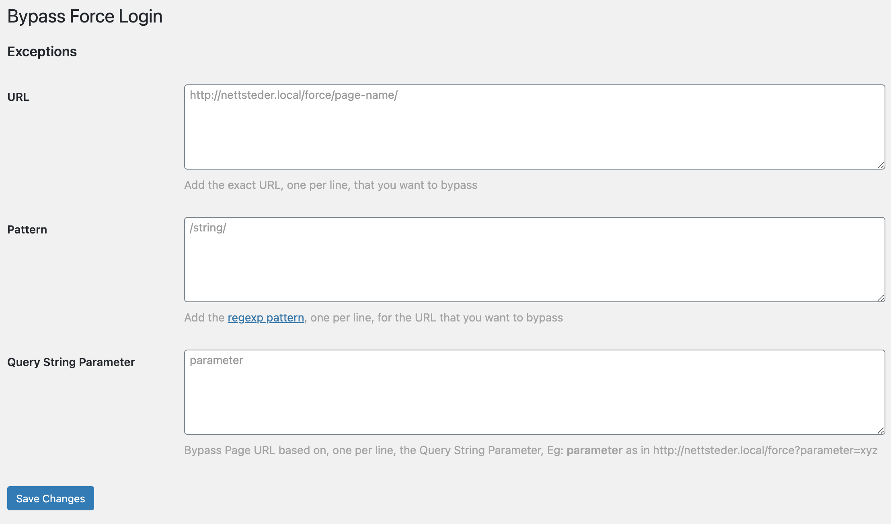

# Bypass [Force Login](https://wordpress.org/plugins/wp-force-login/)

Easily add [exceptions](https://wordpress.org/plugins/wp-force-login/#2.%20how%20can%20i%20add%20exceptions%20for%20certain%20pages%20or%20posts%3F) for the [Force Login](https://wordpress.org/plugins/wp-force-login/) plugin

## Prerequisite

Install and activate [Force Login](https://wordpress.org/plugins/wp-force-login/).

## Installation

- [Download the plugin](https://github.com/soderlind/bypass-wp-force-login/archive/refs/heads/main.zip)
- Install and activate the plugin.
- Add the `[es6demo]` shortcode to a page.
- Click on the `+` button to increment the number.

## Copyright and License

Bypass Force Login is copyright 2021 Per Soderlind

Bypass Force Login is free software: you can redistribute it and/or modify it under the terms of the GNU General Public License as published by the Free Software Foundation, either version 2 of the License, or (at your option) any later version.

Bypass Force Login is distributed in the hope that it will be useful, but WITHOUT ANY WARRANTY; without even the implied warranty of MERCHANTABILITY or FITNESS FOR A PARTICULAR PURPOSE. See the GNU General Public License for more details.

You should have received a copy of the GNU Lesser General Public License along with the Extension. If not, see http://www.gnu.org/licenses/.
